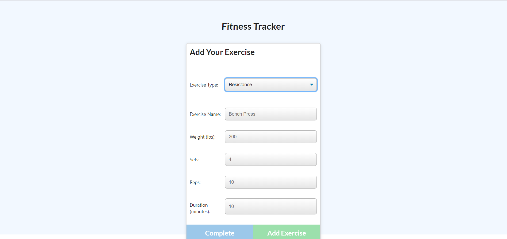
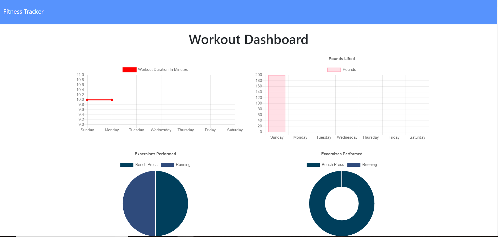

# Fitness-Tracker
Week 17 homework

## Description
Node.js based Web Application for tracking workouts that are split into different exercises that produces some graphic data.

## Installation

install the required packages via "npm install" in the root directory (location of packages.json)

## Usage 

Program is deployed at https://fitness-tracker-mh.herokuapp.com/.
The user can create a new workout or update the existing one. After choosing, the user then inputs information about the exercise they completed and submits it to be stored in the database. The user can then go to the dashboard link to look at the stats of their past workouts.

## Credits

None

## License

MIT License

Copyright (c) 2020 Michael Hrivnak

Permission is hereby granted, free of charge, to any person obtaining a copy
of this software and associated documentation files (the "Software"), to deal
in the Software without restriction, including without limitation the rights
to use, copy, modify, merge, publish, distribute, sublicense, and/or sell
copies of the Software, and to permit persons to whom the Software is
furnished to do so, subject to the following conditions:

The above copyright notice and this permission notice shall be included in all
copies or substantial portions of the Software.

THE SOFTWARE IS PROVIDED "AS IS", WITHOUT WARRANTY OF ANY KIND, EXPRESS OR
IMPLIED, INCLUDING BUT NOT LIMITED TO THE WARRANTIES OF MERCHANTABILITY,
FITNESS FOR A PARTICULAR PURPOSE AND NONINFRINGEMENT. IN NO EVENT SHALL THE
AUTHORS OR COPYRIGHT HOLDERS BE LIABLE FOR ANY CLAIM, DAMAGES OR OTHER
LIABILITY, WHETHER IN AN ACTION OF CONTRACT, TORT OR OTHERWISE, ARISING FROM,
OUT OF OR IN CONNECTION WITH THE SOFTWARE OR THE USE OR OTHER DEALINGS IN THE
SOFTWARE.
